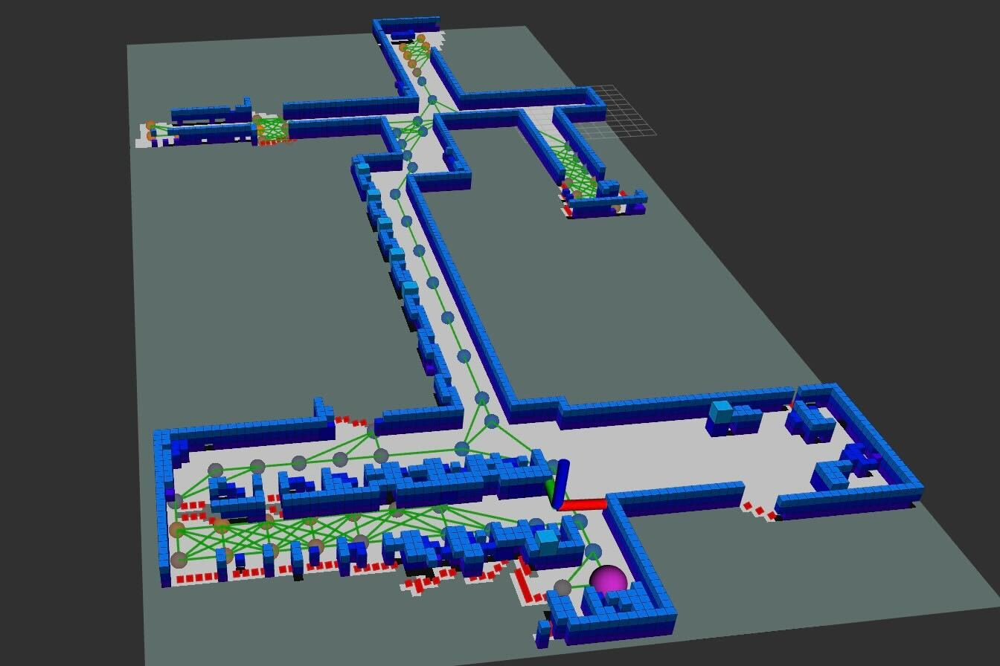
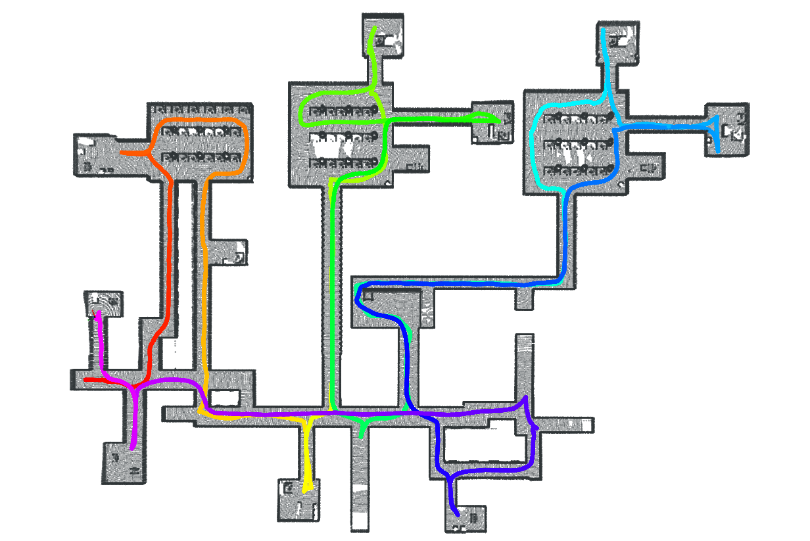
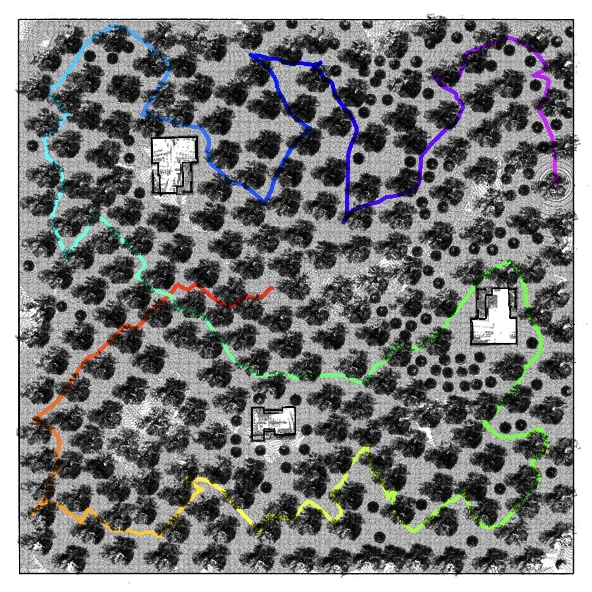
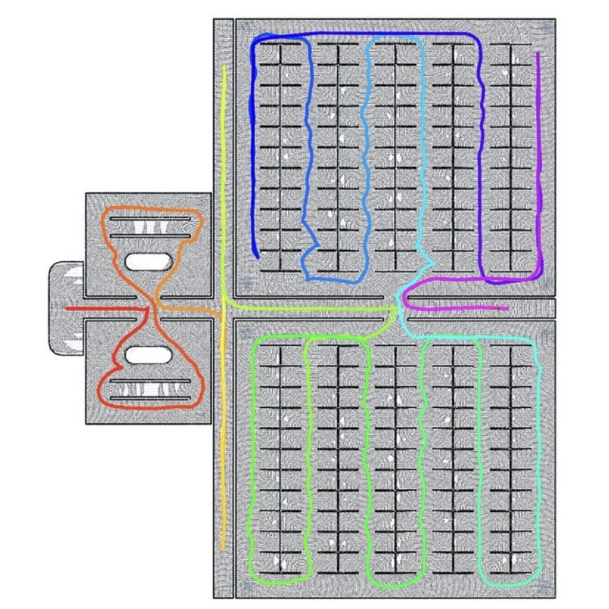
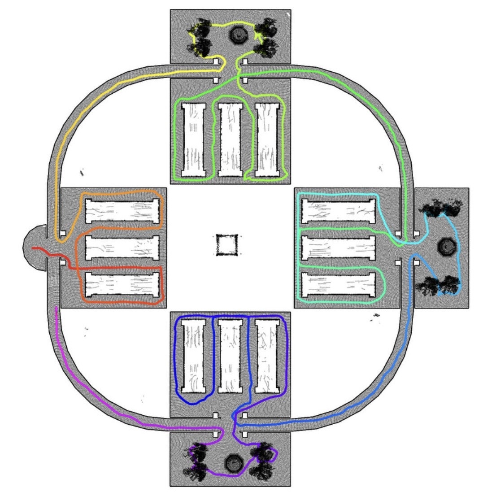
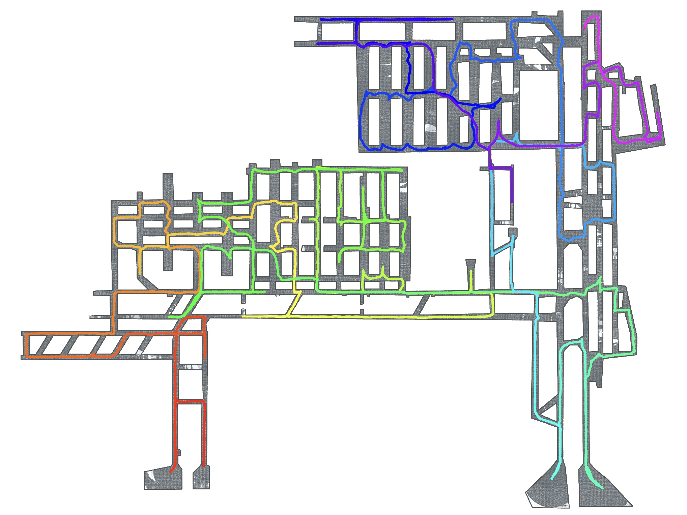

# ARiADNE-ROS-Planner

ARiADNE is **A** **R**e**i**nforcement learning apporach using **A**ttention-based **D**eep **N**etwork.
It is designed to tackle Lidar-based autonomous single-robot exploration in 2D action space.
ARiADNE builds an informative graph based on the partial exploration map as the input of the attention-based neural network.
The neural network trained by deep reinforcement learning will select one of the neighboring nodes as the next waypoint iteratively. 
The robot will follow the planned waypoint to explore the environment.
The planner is trained to estimate the long-term exploration efficiency of each potential waypoint and find a policy that can maximize the expectation of the predicted exploration efficiency.
The informative graph can be rarefied to make it applicable in relatively larger-scale applications.

If you are interested in more details, please check our related publications in [ICRA2023](https://arxiv.org/pdf/2301.11575) and [RAL](https://arxiv.org/pdf/2403.10833).

This branch contains the source code for ARiADNE planner in ROS2. 

<p align="center">

</p>

## Demo
Here is a demo video showing ARiADNE planner exploring the indoor environment provided by [TARE](https://github.com/caochao39/tare_planner/tree/melodic-noetic). 
The video is playing at the original speed.
This experiment was conducted on an ASUS mini PC with an Intel i7-12700H CPU. 

https://github.com/user-attachments/assets/e4aecdb2-9c6e-4803-996b-25efc4cae221

In this demo, the robot traveled 948m in 545s when the exploration was completed. 
The average planning time was 0.17s.
The average waypoint publishing frequency was around 2.5Hz. 
You can find the per-step record [here](demo/metrics.txt). 
The final exploration trajectory is shown below.    

<p align="center">

</p>

The largest environment we tested is the tunnel environment as below:

https://github.com/user-attachments/assets/6d4465eb-38fb-4fb5-943d-4e9a9953c75a

## Usage
### 1. Prerequisites
We tested this planner on Ubuntu 22.04 ROS [Humble](https://wiki.ros.org/humble/Installation).
In particular, our planner relies on [Octomap](https://octomap.github.io/) to transfer pointcloud to occupancy grid map:
```
sudo apt-get install ros-humble-octomap-server
```
We recommend to use [conda](https://conda.io/projects/conda/en/latest/user-guide/install/linux.html#) for package management. 
It is not very easy to use conda with ROS2 but somehow we make it work (will be easier to use the system Python though):
```
conda create -n ros2-torch python=3.10.12
conda activate ros2-torch
pip install torch torchvision --index-url https://download.pytorch.org/whl/cpu
pip install scikit-image 
pip install rospkg
pip install -U colcon-common-extensions
```
Then you can download this repo and compile it in the conda environment.
```
git clone https://github.com/marmotlab/ARiADNE-ROS-Planner.git -b humble
cd ARiADNE-ROS-Planner
python -m colcon build
```
**Note:** We only use CPU to do the network inference, so you do not need a GPU.

### 2. Development environments
In practice, our planner needs to cooperate with a Lidar SLAM module which outputs sensor odometry and Lidar scan, and a waypoint follower module which navigates the robot to the planned waypoint.
Fortunately, you can test our planner easily in the development environments provided by [CMU Robotics Institute](https://www.cmu-exploration.com/development-environment).

Please follow instructions for [CMU Development Environment](https://www.cmu-exploration.com/development-environment) to set up the Gazebo simulation, SLAM module, and waypoint follower module.

### 3. Run the code
To run the development environment, go to the development environment folder in a terminal and run:
```
source install/setup.bash
ros2 launch vehicle_simulator system_indoor.launch
```
Our planner can work in three of their environments: indoor, forest, and tunnel.

To run ARiADNE planner, go to the planner folder in another terminal (launch your conda environment if any) and run:
```
source install/setup.bash
ros2 launch rl_planner rl_planner.launch.py 
```
This launch file is for the indoor environment. For other environments, please update the parameters followed our ROS1 examples.

### 4. Test in other environments
To get better performance in different environments, you most likely need to tune some parameters in the launch file, such as the node resolution, the frontier downsample factor, and maybe the replanning frequency.
Some brief introduction of these parameters can be found in ``parameter.py.``
Here are examples of applying ARiADNE planner in CMU forest and tunnel and two indoor scenarios provided by [FAEL](https://github.com/SYSU-RoboticsLab/FAEL/tree/main).

<p align="center">

</p>
<p align="center">

</p>

### 5. Train your own networks
You can train your own networks using [ARiADNE](https://github.com/marmotlab/ARiADNE) or its [ground truth critic variant](https://github.com/marmotlab/large-scale-DRL-exploration). To run the trained model, replace the checkpoint file under the model folder.

## Citation
If you find our work helpful or enlightening, feel free to cite our paper:

```
@inproceedings{cao2023ariadne,
  title={Ariadne: A reinforcement learning approach using attention-based deep networks for exploration},
  author={Cao, Yuhong and Hou, Tianxiang and Wang, Yizhuo and Yi, Xian and Sartoretti, Guillaume},
  booktitle={2023 IEEE International Conference on Robotics and Automation (ICRA)},
  pages={10219--10225},
  year={2023},
  organization={IEEE}
}
```

```
@article{cao2024deep,
  title={Deep Reinforcement Learning-based Large-scale Robot Exploration},
  author={Cao, Yuhong and Zhao, Rui and Wang, Yizhuo and Xiang, Bairan and Sartoretti, Guillaume},
  journal={IEEE Robotics and Automation Letters},
  year={2024},
  publisher={IEEE}
}
```

## Author
[Yuhong Cao](https://www.yuhongcao.online)
Chenyu He

## Credit

[Development environment](https://www.cmu-exploration.com/development-environment) is from CMU.

[Octomap](https://octomap.github.io/) is from University of Freiburg.

[Quad tree](https://github.com/toastdriven/quads) is from [Daniel Lindsley](https://github.com/toastdriven).

[ChatGPT](https://chatgpt.com/) also contributes some code here and there.

